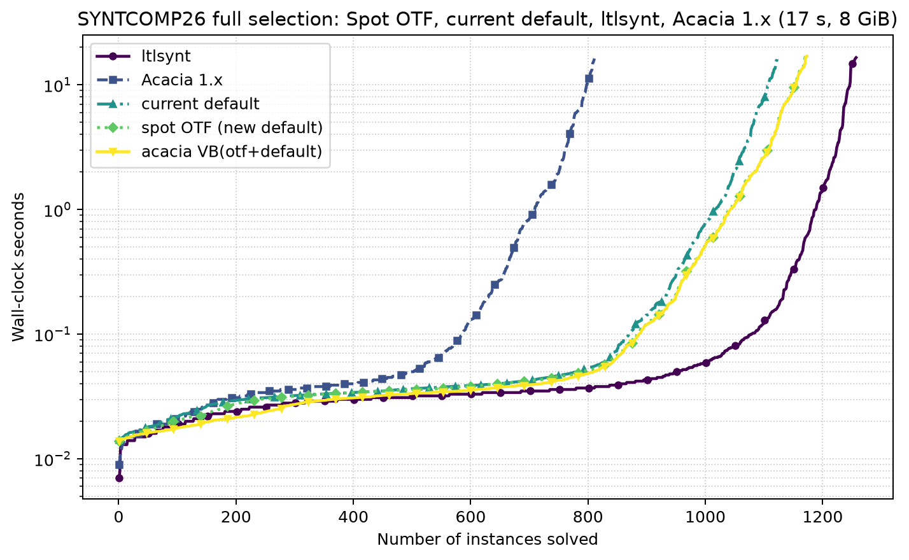

# Acacia-Bonsai changelog

From the Acacia 1.x `TACAS23` snapshot (`5ffd8f99`, 2022-11-11) through
2026-09-25. Release dates below follow the release record; other dates follow
the commits and PRs. PAR-2 charges every unanswered case twice the time cap.

## Latest released three-way comparison

Released with **v2.4.2** (2026-09-09) and still the latest checked comparison
against the baselines; v2.4.3 shipped no new comparison. Full **1,524-case
SYNTCOMP26** selection, **17 s** cap, **8 GiB**, zero swap.

| series | solved / 1,524 | PAR-2 (s) |
|---|---:|---:|
| `ltlsynt` 2.15.1.dev | **1,257** | **9,515.826** |
| Acacia VB(arriving + departing) | 1,173 | 12,684.211 |
| `otf_sparse_formula` (arriving) | 1,171 | 12,736.344 |
| `best_four_arm_contradiction` (departing) | 1,123 | 14,254.294 |
| Acacia 1.x | 811 | 24,785.471 |

The virtual best (VB) is a synthetic per-instance best of the two Acacia
presets, not a runnable configuration. The Acacia 1.x row uses a binary that
can misreport a crashed worker as REALIZABLE (see below), so it may be
flattering. [Report](benchmarking/plots/spot-otf-threeway-20260909/README.md),
[PAR-2 table](benchmarking/plots/spot-otf-threeway-20260909/syntcomp26-full-par2.md),
[provenance](benchmarking/plots/spot-otf-threeway-20260909/PROVENANCE.txt).

## Measured performance milestones

- **v2.1 precursor:** [PR #115](https://github.com/gaperez64/acacia-bonsai/pull/115)
  (merged 2026-07-04)
  moved a **selected SYNTCOMP24 loss/slow cohort** from **6 to 71/192** solved
  and cut total time on the slow set from **190 to 80 s**. The v2.2 full-corpus
  gate superseded this selected-cohort result as the headline.
- **v2.2 (2026-08):** The native TLSF, symmetry and optimization-gate branch
  improved the same `best_decomp_mona` configuration from **796 to 866/1,195**
  solved and **13,932.144 to 11,536.661 s** PAR-2 on SYNTCOMP24; on the clean
  SYNTCOMP21 rerun it moved **731 to 765/945** and **7,578.101 to 6,390.658 s**.
  These were sequential **17 s, 8 GiB, zero-swap** gates, not a comparison of
  different portfolio menus. [PR #118](https://github.com/gaperez64/acacia-bonsai/pull/118),
  [measurement protocol](benchmarking/README.md).
- **v2.4 (2026-09):** On the full **1,524-case SYNTCOMP26** set, the sprint's
  measured four-arm portfolio improved the B reference configuration
  (`best_decomp_rank_bucketed_semantic_mona`) from **976/1,524,
  19,160.668 s** PAR-2 to **1,057/1,524, 16,687.479 s** at **17 s, 8 GiB,
  zero swap**. In the staged census, the v2.3 `docker_default` group's strongest
  member scored **966/1,524**; its derived union scored **974/1,524**. The
  later v2.4.2 menu superseded the portfolio.
  [Full comparison](benchmarking/plots/three-way-full-20260905/README.md),
  [configuration census](benchmarking/OTF-AND-SPOT.md#the-incumbents-are-near-duplicates-confirmed-at-scale).
- **v2.4.2 (2026-09):** Replacing one shipping configuration with the guarded
  Spot unrealizability arm changed that slot from **1,123 to 1,171/1,524** and
  **14,254.294 to 12,736.344 s** PAR-2 on full SYNTCOMP26 at **17 s, 8 GiB,
  zero swap**. There were **50 gains and two losses**: 49 UNREALIZABLE gains
  and one loss, plus one REALIZABLE gain and one loss. The net was **+48
  UNREALIZABLE**, with REAL unchanged at **533**. The arriving/departing virtual
  best was 1,173, and `ltlsynt` still led at 1,257.
  [Primary results](benchmarking/OTF-AND-SPOT.md#full-corpus-primary-results),
  [three-way report](benchmarking/plots/spot-otf-threeway-20260909/README.md).
- **September GR(1) research (unreleased):** The cold M6 route certified **26
  previously unsolved instances** (22 REAL, 4 UNREAL) among **55 selected
  SYNTCOMP26 targets** inside **120 s**, with an **8 GiB** enclosing scope;
  baseline Acacia B and S solved zero of these targets. This was a selected
  subset, **not** a full-corpus portfolio gain. Its family-registry route was
  subsequently **withdrawn**; the native, generic replacement is in progress.
  [M6 report](benchmarking/param-lift-20260922/m6-report.md),
  [withdrawal](benchmarking/gr1-par2-20260923/decisions.md).

The older Acacia 1.x comparison is useful but **not a sound speedup baseline**:
before `e84b968c`, a signal-killed child could be reported as REALIZABLE. The
August 2026 17 s/8 GiB panels measured current versus 1.x at **871 versus
745 status-matching/scored answers** on the 1,011-case SYNTCOMP24 selection
and **136 versus 104 status-matching/scored answers** on the 180-case SYNTCOMP26
panel; 1.x's apparent solved counts can be overstated.
See [the panels](benchmarking/plots/final-v1-current-20260825/README.md) and
[the defect analysis](benchmarking/LTLSYNT-GAP.md#the-acacia-1x-rows-are-measured-with-a-binary-that-misreports-crashes).

## Timeline (newest first)

### Unreleased, September 2026

- **Sep 23–25:** Draft [PR #192](https://github.com/gaperez64/acacia-bonsai/pull/192) is porting source-bound, generic GR(1) and parameter-lifting arms into Acacia through tlsf-tools; the native GR(1) arms and per-arm deadline fix landed, while full-corpus and integrated portfolio measurements remain in progress. [Decisions](benchmarking/gr1-par2-20260923/decisions.md).
- **Sep 24:** The earlier 14-family registry and sequential lifting wrapper were **withdrawn** after the 91-case selection campaign: routing depended on names and family-specific data from the evaluation corpus. Its partial full-corpus run is not a result. [Decisions](benchmarking/gr1-par2-20260923/decisions.md).
- **Sep 22–23:** Draft [PR #191](https://github.com/gaperez64/acacia-bonsai/pull/191) added exact GR(1) reduction, certificate export and target checking, and the selected-subset M6 result above; the all-parameter proof attempt did not close. [Closing report](benchmarking/param-lift-20260922/closing/README.md).
- **Sep 18–22:** Draft [PR #190](https://github.com/gaperez64/acacia-bonsai/pull/190) added verified witness-lifting research and an environment witness for UNREALIZABLE synthesis; its broad structural-selector candidate was rejected for confirmed regressions at both 17 s and 120 s. [Closing report](benchmarking/witness-lifting-20260918/closing/README.md).
- **Sep 16–18:** [PRs #186–#189](benchmarking/demand-sparse-20260916/closing/README.md) recorded full-corpus, three-way PAR-2 reports and validated export tools; the demand-sparse and symbolic-rows candidates admitted no solver change after confirmation found regressions. [Symbolic-rows closing](benchmarking/symbolic-rows-20260917/closing/README.md).

### v2.4.3 (2026-09-14)

- Sparse OTFUR work elimination, guarded-choice covering and arm diagnostics landed with the [adaptive portfolio sprint](benchmarking/ADAPTIVE-PORTFOLIO-OTFUR-SPRINT.md); its panel evidence did not justify a new shipping menu. [PRs #151–#159 and #161–#176](https://github.com/gaperez64/acacia-bonsai/pull/176).

### v2.4.2 (2026-09-09)

- [PR #142](https://github.com/gaperez64/acacia-bonsai/pull/142) added guarded symbolic-letter Spot solving and replaced one shipping unrealizability configuration; the full-corpus **net +48 UNREALIZABLE** and PAR-2 change are above. [Sprint record](benchmarking/OTF-AND-SPOT.md).

### v2.4 / v2.4.1 (2026-09-06)

- [PRs #125–#129 and #136–#137](benchmarking/COVERAGE.md) added a forward safety-game backend, a forced-output contradiction check and runtime per-polarity arm selection; the later measured four-arm full-corpus run was **1,057/1,524**. [Full comparison](benchmarking/plots/three-way-full-20260905/README.md).
- [PRs #122–#123](benchmarking/SEMANTIC-ACTIONS-AND-M2-SPRINT.md) added semantic-action deduplication and two-sided local certificates; the former gained **3/180** SYNTCOMP25 panel answers at the standard 17 s/8 GiB gate, while the latter reached **1,065 versus 1,056/1,524** on the 17 s SYNTCOMP26 census. [Coverage record](benchmarking/COVERAGE.md).

### v2.3 (2026-08-29)

- PRs [#119](https://github.com/gaperez64/acacia-bonsai/pull/119) and [#121](https://github.com/gaperez64/acacia-bonsai/pull/121) removed static sizing and then the zero-tail vector wrapper; the measured optimized build fell from **421.19 s / 6,459,456 KiB** to **61.24 s / 586,940 KiB** before the bare-vector follow-up retracted an earlier non-isolated runtime claim. This is a build-resource result, not a solver speedup. [Data-structure study](benchmarking/DATA-STRUCTURES.md).

### v2.2 (2026-08-19)

- [PR #118](https://github.com/gaperez64/acacia-bonsai/pull/118) landed native TLSF parsing, in-process controller conversion, symmetry/equivariant solving, four measured Docker configurations and repeatable correctness/performance gates; its full-corpus gate gains are above. [Frontend and gate protocol](benchmarking/README.md).

### v2.1 / v2.1.2 (2026-07-31 to 2026-08-01)

- [PR #113](https://github.com/gaperez64/acacia-bonsai/pull/113) introduced the configuration registry, Spot fast path and equivariant solver infrastructure; [PR #115](https://github.com/gaperez64/acacia-bonsai/pull/115) added up-front simplification and translation preference, with the selected-cohort result above. v2.1.2 adopted git-derived versioning. [Registry](README.md#compile-time-configurations).

### v2.0–v2.0.17 (2026-04-18 to 2026-04-25)

- v2.0 brought CLI and Boomslang Docker images, Python/Jupyter bindings and synthesis wrappers; subsequent 2.0 releases added multi-architecture images, PyPI wheels and the FMCAD benchmark driver. PRs [#86](https://github.com/gaperez64/acacia-bonsai/pull/86), [#88](https://github.com/gaperez64/acacia-bonsai/pull/88), [#89](https://github.com/gaperez64/acacia-bonsai/pull/89); [benchmark driver commit](https://github.com/gaperez64/acacia-bonsai/commit/66c77336).
- **Apr 16 (before v2.0):** `e84b968c` fixed BDD variable registration and the signal-killed-worker **false REALIZABLE** result; this changes which old answers can be trusted. [Defect analysis](benchmarking/LTLSYNT-GAP.md#the-acacia-1x-rows-are-measured-with-a-binary-that-misreports-crashes).

### v1.9–v1.9.2 (2025-12-23 to 2026-04-07)

- The 2025 solver refactor split automaton/game construction, restored unrealizability and moved the CLI to `getopt`; 2026 specification splitting and synthesis work added broad synthesis tests and fixed nondeterministic Mealy output. PRs [#61](https://github.com/gaperez64/acacia-bonsai/pull/61), [#64](https://github.com/gaperez64/acacia-bonsai/pull/64), [#77](https://github.com/gaperez64/acacia-bonsai/pull/77), [#78](https://github.com/gaperez64/acacia-bonsai/pull/78), [#85](https://github.com/gaperez64/acacia-bonsai/pull/85).

### syntcomp24 / 2024 (2024-05 to 2024-08)

- The SYNTCOMP24 tag packaged the competition configuration and synthesis fixes; [PR #50](https://github.com/gaperez64/acacia-bonsai/pull/50) later added winning-region export/simulation, and July migrated downsets to Posets. No comparable gain is recorded here. [History](https://github.com/gaperez64/acacia-bonsai/pull/50).

### syntcomp23 / 2023 (2023-06 to 2023-12)

- [PR #21](https://github.com/gaperez64/acacia-bonsai/pull/21) added AIG controller synthesis and model-checking tests; [PR #29](https://github.com/gaperez64/acacia-bonsai/pull/29) added compositional solving with parallel workers.
- [PRs #38 and #44](https://github.com/gaperez64/acacia-bonsai/pull/44) revised the antichain/k-d-tree downsets and added a vector-or-k-d-tree representation and downset benchmarks; no solver-wide speedup was established in those PR records.

### TACAS23 (2022-11-11)

- Baseline Acacia 1.x snapshot `5ffd8f99`: universal co-Büchi synthesis with antichain/downset bounded-safety solving. [Project overview](README.md).

## Claims omitted for lack of a verified comparison

- A full-corpus or shipped-portfolio speedup from the current native GR(1)/parameter-lifting arms: the per-arm and integrated campaigns are unfinished.
- A solver speedup from the v2.3 bare-vector or 2023 k-d-tree changes: their available records do not establish one.

**VERDICT:** The changelog records measured gains with their scope and caveats; the withdrawn route and unfinished work are not presented as production performance results.
