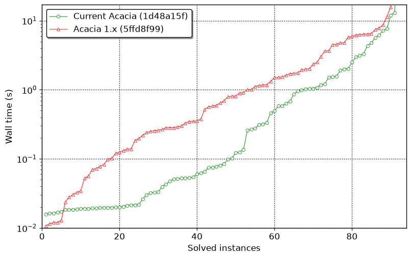
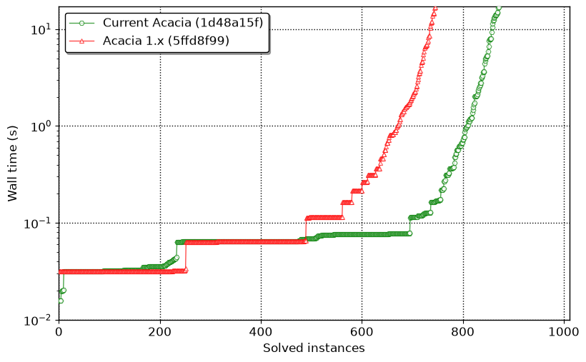
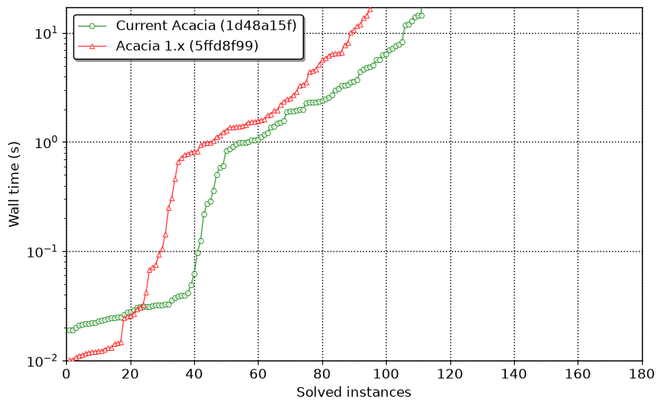
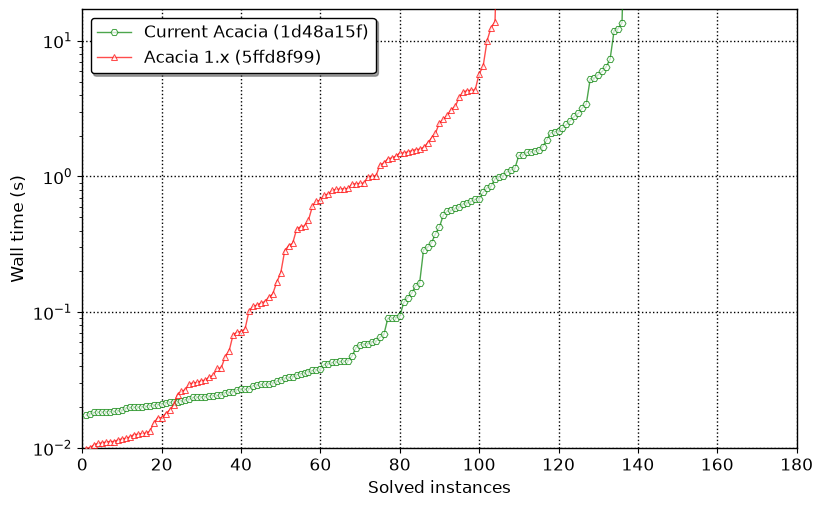

# Final current-versus-Acacia-1.x panels

These cactus plots were generated from the checksum-verified accepted series
under `_bm-logs.final-v1-current-1d48a15f-20260825`. The benchmarked revisions
are current Acacia `1d48a15f` with Posets `4f79e9f` and tlsf-tools `ca27906`,
and Acacia 1.x `5ffd8f99`. Runs were serialized, with a 17-second deadline and
one 8 GiB, zero-swap user-systemd scope per solver invocation.

Only correct answers contribute points to a cactus curve. Timeouts, resource
limits, unknown/error results, and verdicts that disagree with declared panel
status are excluded.

| panel | current solved / PAR-2 s | Acacia 1.x solved / PAR-2 s |
|---|---:|---:|
| SYNTCOMP21 critical | 91/94 / 202.352 | 90/94 / 304.527 |
| SYNTCOMP24 0s-20s | 871/1,011 / 5,191.507 | 745/1,011 / 9,470.106 |
| SYNTCOMP25 | 111/180 / 2,597.586 | 95/180 / 3,124.637 |
| SYNTCOMP26 | 136/180 / 1,627.912 | 104/180 / 2,709.865 |

## SYNTCOMP21 critical

[PDF](syntcomp21-crit-current-v1.pdf) · [PNG](syntcomp21-crit-current-v1.png)

## SYNTCOMP24 0s-20s

[PDF](syntcomp24-0s-20s-current-v1.pdf) · [PNG](syntcomp24-0s-20s-current-v1.png)

## SYNTCOMP25

[PDF](syntcomp25-panel-current-v1.pdf) · [PNG](syntcomp25-panel-current-v1.png)

## SYNTCOMP26

[PDF](syntcomp26-panel-current-v1.pdf) · [PNG](syntcomp26-panel-current-v1.png)

