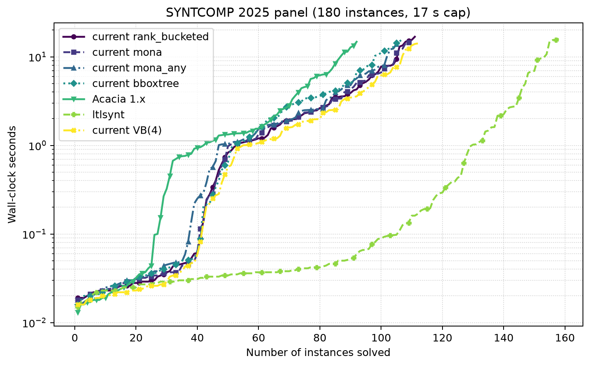
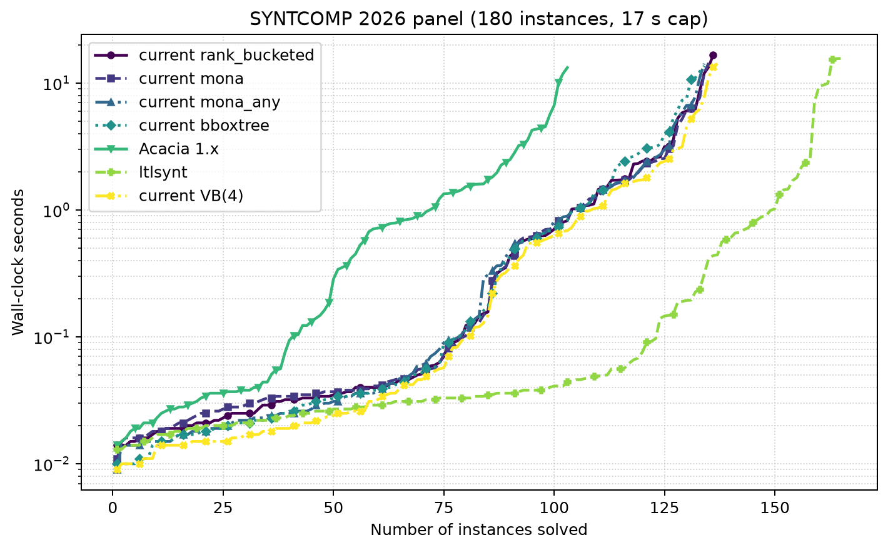

# current vs Acacia 1.x vs `ltlsynt`, SYNTCOMP 2025 and 2026 panels

Twelve serialized arms, 17-second deadline, one 8 GiB zero-swap user-systemd
scope per solver invocation, 120-second cooldowns, arm order reversed on the
second panel so thermal drift cannot be read as a solver effect. Raw rows,
provenance and rejected runs are under `_bm-logs.three-way-20260828`.

Each tool takes its own route from the common `.tlsf`, reconstructed by
`benchmarking/syntcomp-corpus.py materialize` from the `tests/syntcomp-benchmarks`
submodule and verified byte-identical against a committed SHA-256 manifest:

| arm | route |
|---|---|
| current (4 `docker_default` configs) | native TLSF frontend, `-T` |
| Acacia 1.x (`5ffd8f99`) | SyFCo pairs with the `SEMANTICS`→`TARGET` adaptation baked in, since v1 has no `--semantics` flag |
| `ltlsynt` | SyFCo's unadapted pairs plus its own `--semantics` |

`current VB(4)` is the virtual best of the four shipped configurations: the
portfolio the Docker image delivers.

## SYNTCOMP 2025

[PDF](syntcomp25-three-way.pdf) · [PNG](syntcomp25-three-way.png) · [PAR-2 table](syntcomp25-par2.md)

## SYNTCOMP 2026

[PDF](syntcomp26-three-way.pdf) · [PNG](syntcomp26-three-way.png) · [PAR-2 table](syntcomp26-par2.md)

## What the numbers say

`ltlsynt` leads decisively on both panels: 158/180 against the portfolio's 112
on 2025, and 165/180 against 137 on 2026, with roughly a third of the PAR-2.
The gap is one-sided but not total -- the current portfolio still answers 7
instances on 2025 and 2 on 2026 that `ltlsynt` does not, while `ltlsynt`
answers 53 and 30 that the portfolio does not.

Current is far ahead of Acacia 1.x: 112 versus 92 on 2025 and 137 versus 103 on
2026, and v1 additionally returns a non-verdict (UNKNOWN or ERROR) on 14 and 7
instances where current returns an answer.

`rank_bucketed` alone reproduces the previously published figures for both
panels exactly, 111 and 136, which is an independent check that the harness and
the reconstructed corpus agree with the earlier campaign.

## The four shipped configurations are one more than these panels need

Marginal contribution inside the portfolio, measured on these runs:

| panel | rank_bucketed | mona | mona_any | bboxtree | union(4) | best 3-subset |
|---|---:|---:|---:|---:|---:|---:|
| 2025 | 1 | 0 | 1 | **0** | 112 | 112 |
| 2026 | 1 | 0 | 1 | **0** | 137 | 137 |

On both panels `best_decomp_bboxtree_mona` contributes nothing the other three
do not already solve, and `rank_bucketed + mona + mona_any` reaches the full
union on its own.

This revises, for these panels, the justification recorded from the 2026-08-18
round-2 campaign, where `bboxtree` ranked last solo (196/354) yet contributed 2
unique instances and every top-coverage 4-subset contained it. That campaign
scored the combined SYNTCOMP24+25 panels; these score 2025 and 2026. The honest
reading is that `bboxtree`'s value, if it has one, rests on SYNTCOMP24, which
this campaign does not measure. Dropping it should be decided against a
SYNTCOMP24 run, not against this one.

## Caveats

Two of the 307 distinct panel TLSF files declare `Strict` semantics, which
SyFCo's `ltlxba` printer cannot express. On those two, Acacia 1.x and `ltlsynt`
solve the non-strict reading while current solves the strict one.

`ltlsynt` aborts on two 2026 instances with a Spot assertion failure in the
Zielonka-tree parity construction; see `SPOT-ANOMALIES.md`. They count as
unanswered, which is why its 2026 total is 165 rather than 167.

The machine thermally throttles across long campaigns. Coverage figures are
robust; fine-grained PAR-2 deltas between adjacent rows should be read as
directional.
