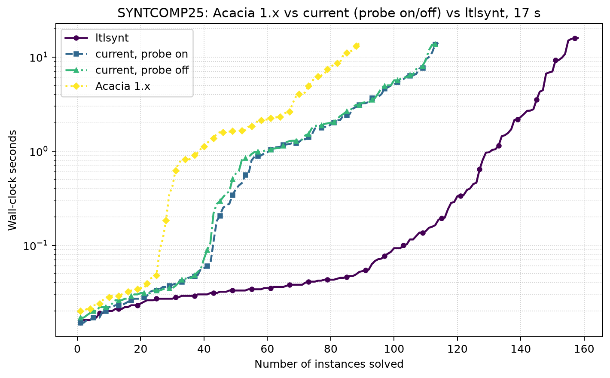
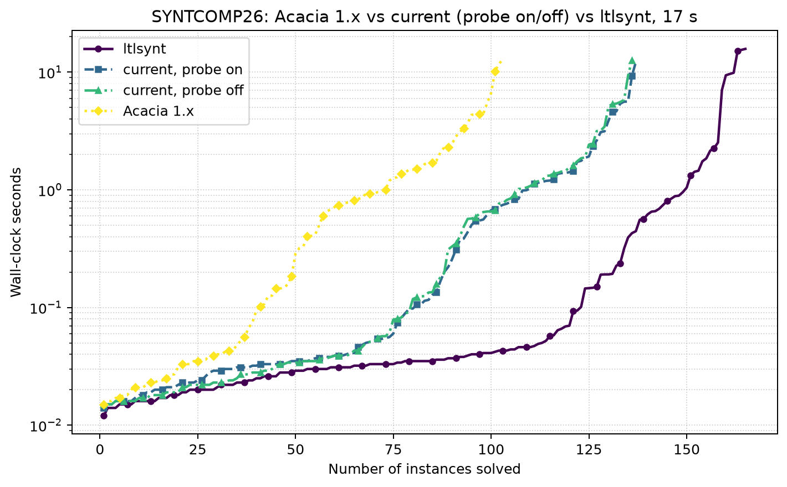

# Acacia 1.x vs current (probe off / probe on) vs `ltlsynt`, SYNTCOMP 2025 and 2026

Eight serialized arms, 17-second deadline, one 8 GiB zero-swap user-systemd scope
per solver invocation, 120-second cooldowns, arm order reversed on the second
panel so thermal drift cannot be read as a solver effect. Panel lists, TLSF maps
and both SyFCo caches are reused verbatim from `_bm-logs.three-way-20260828`, so
each tool takes exactly the route it took there. Raw rows and provenance are
under `_bm-logs.three-way-probe-20260831`.

The two current arms differ only in the local certificate probe. They were
verified with `nm` rather than `meson configure`: turning the probe on by
default makes `meson configure` report `true` for build directories whose
binaries contain no probe at all.

## SYNTCOMP 2025

[PDF](syntcomp25-three-way.pdf) · [PNG](syntcomp25-three-way.png) · [PAR-2 table](syntcomp25-par2.md)

## SYNTCOMP 2026

[PDF](syntcomp26-three-way.pdf) · [PNG](syntcomp26-three-way.png) · [PAR-2 table](syntcomp26-par2.md)

## What the numbers say

`ltlsynt` leads decisively on both panels -- 158/180 against 114 on 2025 and
165/180 against 137 on 2026, with roughly a third of the PAR-2. Against that
gap the probe's +1 per panel is real but small, and the substantial Acacia
movement is the +24 and +34 over Acacia 1.x.

The gap is one-sided but not total. The current solver still answers 7
instances on 2025 and 2 on 2026 that `ltlsynt` does not, so a portfolio of the
two would reach 165 and 167. There are **no verdict disagreements** with
`ltlsynt` on any instance both solve, on either panel.

Reproducibility against the 2026-08-28 run is good for the two stable arms:
`ltlsynt` repeats 158/180 at 921.3 s (was 921.8 s) and 165/180. Acacia 1.x
moved from 92 to 90 on 2025 while its 14 non-timeout outcomes matched exactly,
which sets the scale of run-to-run noise: differences of a couple of instances
are not signal.
